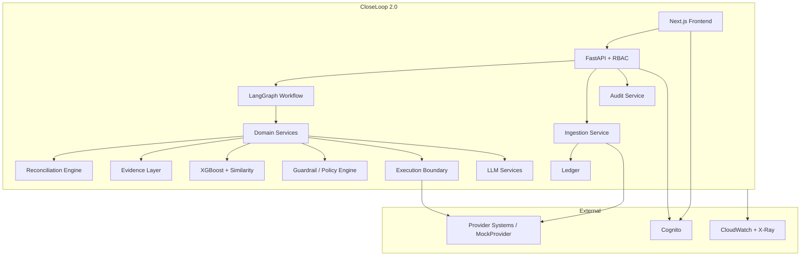
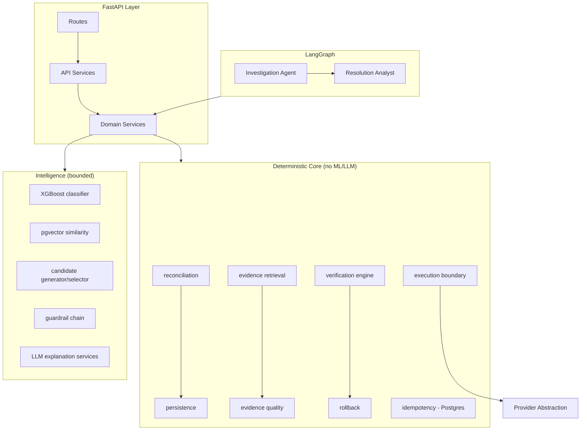
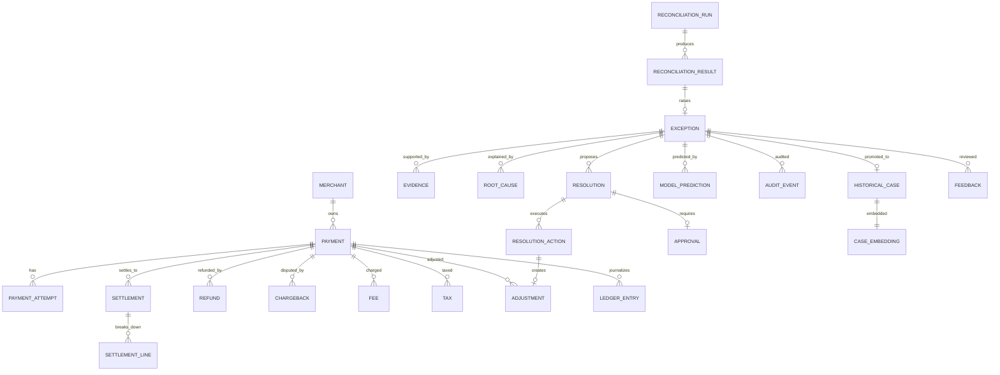
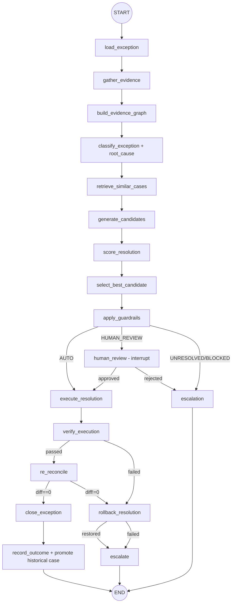
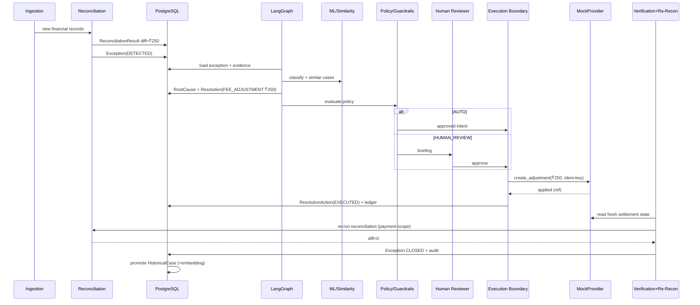
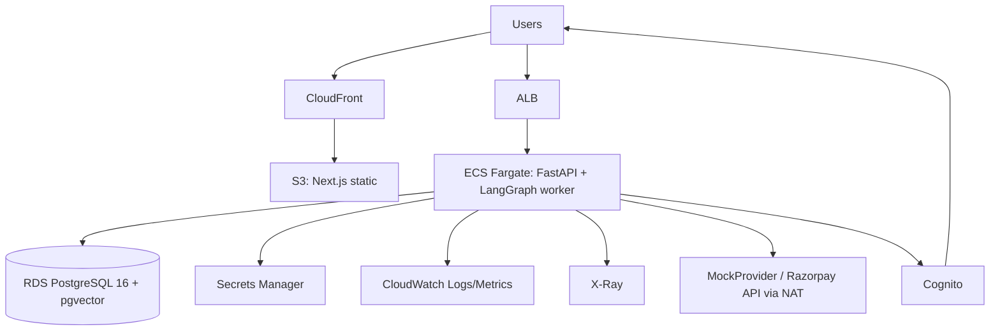

# CloseLoop 2.0 — Architecture Freeze & System Design

> **Status:** PROPOSED — pending review. No code has been modified.
> **Basis:** Direct inspection of the repository (2026-09-27). Every claim below was verified against source files; discrepancies with the earlier audit are called out explicitly.

---

## 3. REPOSITORY RE-INSPECTION (VERIFIED FINDINGS)

### 3.1 What actually exists

| Area | Reality (verified) |
|---|---|
| **Backend** | FastAPI (`app/main.py`), 6 routers (batches, exceptions, intelligence, learning, metrics, models) + `/health`, `/analyze`, `/explain`. Clean error-handling layer with request-ID middleware. |
| **Reconciliation** | `app/reconciliation/{contract,engine,matching}.py` — genuinely deterministic, integer-paise, formula frozen in `contract.py` (`expected = payment − refunds − fees − taxes + adjustments`). Classification via ratio-band rules. **No tolerant/ambiguous matching layers** — matching is a strict `payment_id` filter plus duplicate detection. |
| **Evidence** | `services/evidence_retrieval.py` (deterministic retrieval, missing-evidence detection, conflict detection, idempotent `EvidenceLink` persistence) and `services/evidence_graph.py` (NetworkX DiGraph with signed `contribution_to_expected`, EXPLAINS edges, missing-evidence placeholder nodes). **Strongest part of the codebase.** |
| **Guardrails** | `services/guardrail_engine.py` chains Confidence Gate → Exposure Guard → Evidence Guard → Fallback Guard → Decision Matrix. Fail-closed on internal errors. Real, well-tested. |
| **Resolution** | `services/resolution_engine.py` + `candidate_generator/score/selector` — evidence-traced adjustments, multi-source merging (deterministic / ML / historical), UNRESOLVED status supported. Recommendation-only. Real. |
| **Verification & Rollback** | `services/resolution_verification.py` (independent recalculation, 5 checks, discrepancy-eliminated check) and `services/rollback.py` (controlled reversal + post-rollback verification + escalation). Real logic, but operates on in-memory snapshots, not persisted financial state. |
| **LangGraph** | `app/agent/workflow.py` — 17-node graph, correct topology including execution → verify → rollback routing and observability wrapping. **BUT**: `load_exception`, `gather_evidence`, `build_evidence_graph`, `classify_exception`, `retrieve_similar_cases`, `generate_candidates`, `score_resolution`, `select_best_candidate` all call `_simulate_*` functions. Execution/verification/rollback nodes call real services. **The graph is real; the investigation half is fake.** |
| **ML** | `app/ml/{classifier,features,engineering,resolution}.py` — full XGBoost pipeline, 24-feature versioned schema, class weighting, evaluation, artifact save/load. `scripts/train_classifier.py` exists. **No trained artifact exists anywhere** (`backend/models/` is empty; no `.joblib` outside `.venv`). Temporal/merchant/historical features default to 0. |
| **Similarity / pgvector** | `services/similarity_service.py` and `embedding_service.py` (all-MiniLM-L6-v2, 384-dim, deterministic case-to-text). **pgvector is NOT used**: `use_pgvector=False` default, embeddings stored as JSON in a `Text` column, search loads the entire table and computes cosine in numpy. The docker image is `pgvector/pgvector:pg16` but no `Vector` column exists. |
| **Database** | `app/models/` — 10 models. `Payment` = 3 columns, `Settlement` = 3 columns. No FK constraints anywhere, no Merchant model, no Chargeback, no LedgerEntry, no Approval/Resolution/AuditEvent tables. `init_db.py` calls `create_all` importing only 3 models. **Alembic is pinned in requirements but no migrations directory exists.** |
| **State that resets on restart** | Batch registry, exception registry (+ JSON status overrides), AuditLogService, FeedbackService, OutcomeService, IdempotencyStore, executed-executions cache — all in-memory dicts. ExceptionService loads cases from JSON files on disk, not from the DB. |
| **LLM** | `app/llm/` — OpenAI/Ollama providers, retry with backoff, 4 services (explanation, evidence explanation, case summary, reviewer assistant) with strict "explanation-only" prompts, structured JSON outputs, deterministic fallbacks. Genuinely well-designed boundary. |
| **MCP** | `backend/mcp/` — read-only tools (input validation, injection checks, clamped limits) and write tools that delegate to the execution service with idempotency. Good pattern; adapters load from JSON files. |
| **Frontend** | Next.js App Router: Control Center, Exceptions list, Exception detail `[id]`, Batches, Learning, Models, System pages; EvidenceGraph component. Polished demo, but driven by the JSON-backed exception registry — the LangGraph workflow is not reachable from the UI, and statuses (PENDING/APPROVED/…) diverge from the DB model's (OPEN/MATCHED/…). |
| **Tests** | 114 test files, ~5,000 tests claimed. Extensive safety/guardrail/execution/rollback coverage. No CI. |
| **Docker** | `pgvector/pgvector:pg16` + backend + frontend compose. No Redis, no worker. |
| **MLflow** | `services/mlflow_*.py` + model registry + promotion — all backed by **in-memory dicts**, not a real MLflow server. |
| **Auth** | None. CORS `allow_origins=["*"]`. README admits it. |
| **Missing entirely** | Merchant table, Chargeback, PaymentAttempt, LedgerEntry, ReconciliationRun (per-run entity), Approval entity, persisted audit, event/outbox tables, provider abstraction, Redis, OpenTelemetry, CI. |

### 3.2 Corrections to the previous audit

1. Audit said "minimal financial database models" — **understated**: several services that *look* database-backed are in-memory; the exception API reads JSON files, not PostgreSQL.
2. Audit said "incomplete historical similarity" — **more accurate**: pgvector is not used at all; similarity is a full-scan numpy computation.
3. Audit said "workflow not fully connected to the UI" — confirmed, plus the UI's status vocabulary and the DB's status vocabulary are different sets.
4. Audit said "no provider abstraction" — confirmed; execution writes an `AdjustmentRecord` into an in-memory dict and fabricates `after_state` arithmetically.
5. Audit missed: guardrail/verification/rollback/LLM/MCP layers are **real and high quality** — the rewrite boundary must not destroy them.

### 3.3 Disposition decisions

| Decision | Applies to |
|---|---|
| **PRESERVE** (move as-is, minimal change) | `reconciliation/contract.py`, `reconciliation/matching.py`, `evidence_retrieval.py`, `evidence_graph.py`, `evidence_quality.py`, `explanation_engine.py`, all 5 guard services + `guardrail_engine.py`, `candidate_generator/scorer/selector.py`, `resolution_engine.py`, `resolution_verification.py`, `financial_diff.py`, `rollback.py` (service core), `ml/features.py`, `ml/classifier.py`, `ml/resolution.py`, `embedding_service.py`, entire `llm/` package, `core/structured_logging.py`, `generator/` package, MCP input-validation & tool-registry patterns. |
| **REFACTOR** (keep logic, change I/O & persistence) | `services/execution.py` (real execution behind provider boundary), `services/idempotency.py` (Postgres-backed), `services/persistence.py` (expand scope), `services/similarity_service.py` (real pgvector), `services/audit_log.py` + `feedback.py` (persisted), API services (DB-backed), LangGraph nodes (call real services), exception/approval status vocabularies (unify). |
| **REWRITE** | LangGraph investigation nodes' bodies (`_simulate_*` → real service calls), exception detail/verification data path in the API. |
| **REMOVE** | `_simulate_*` functions, in-memory batch/exception/audit/feedback registries, fake MLflow in-memory registry (replace with real MLflow client or drop), JSON status_overrides demo hack, numpy full-scan similarity path (keep only as test fallback). |
| **BUILD NEW** | Merchant, Chargeback, PaymentAttempt, LedgerEntry, ReconciliationRun, Resolution, ResolutionAction, Approval, AuditEvent, ModelPrediction, Feedback tables; Alembic migrations; provider abstraction (`PaymentProvider` + `MockProvider` + `RazorpayProvider` stub); execution boundary service; auth/RBAC; policy config layer; re-reconciliation loop node; OTel instrumentation; evaluation harness. |

---

## 4. PRODUCT BOUNDARY

### CloseLoop IS

- A **financial exception intelligence and safe-resolution platform** for a payment provider's internal finance/ops teams.
- It takes a *detected mismatch* between expected and actual settlement money and drives it, with evidence, through: investigation → root cause → resolution proposal → policy decision → (human or automated) approval → controlled execution → **re-reconciliation against the updated financial state** → verification → closure → audit + learning.
- Users: **finance operations analysts** (investigate, review, approve), **engineering/ops** (system health, models, policy), **auditors** (read-only trail).
- Value: exceptions are resolved in minutes instead of days, with every automated action provably safe (guardrails), provably correct (re-reconciliation), and fully auditable; humans spend time only where judgment is genuinely needed.

### CloseLoop IS NOT

- **Not a payment gateway or ledger of record.** It never owns money movement; it proposes and verifies.
- **Not the source of truth for financial records.** Provider systems (Razorpay) remain authoritative; CloseLoop mirrors them through the provider abstraction.
- **Not an autonomous money-moving agent.** Agents propose; policy authorizes; deterministic services execute; reconciliation verifies.
- **Never LLM territory:** computing amounts, settling/refunding, approving actions, bypassing guardrails, mutating records, declaring financial closure.
- **Always human territory:** exception-type overrides on conflicting evidence, high-exposure resolutions, novel (never-seen) patterns, failed re-reconciliation after execution, policy changes, and anything the decision matrix routes to HUMAN_REVIEW.

---

## 5. DOMAIN MODEL

Conventions: all money is `BIGINT` **paise**; all timestamps `TIMESTAMPTZ`; PKs are provider-native IDs where they exist (e.g., `pay_*`, `setl_*`) and ULID-style prefixed IDs otherwise. Every mutable business table gets `created_at`, `updated_at`, and (where stateful) `version INT` for optimistic locking.

### Reference / financial layer

**Merchant** *(NEW — today payments carry a bare string)*
- Purpose: aggregation root for merchant-level features and scoped access.
- Fields: `id` (PK, provider merchant id), `name`, `status`, `category_code`, `onboarded_at`, `metadata JSONB`.
- Relationships: 1-N Payment, Settlement, Exception.
- Indexes: PK; `status`. Persisted: yes. Idempotency: PK = provider id.

**Payment** *(REFACTOR — 3 columns → full record)*
- Fields: `id` PK, `merchant_id` FK, `order_id`, `amount`, `currency`, `status` (see §7.1), `method`, `captured_at`, `provider_created_at`, `version`.
- Indexes: `(merchant_id, provider_created_at)`, `order_id`, `status`.
- Lifecycle: provider-owned; CloseLoop is a read-only mirror updated by ingestion.
- Idempotency: PK = provider payment id (upsert on ingest).

**PaymentAttempt** *(NEW, optional but recommended)*
- Purpose: auth/capture granularity for future debugging; today the generator has one payment = one capture.
- Fields: `id` PK, `payment_id` FK, `attempt_no`, `kind` (AUTH/CAPTURE), `amount`, `status`, timestamps.
- Persisted: yes; index `(payment_id)`.

**Settlement** *(REFACTOR)*
- Fields: `id` PK, `payment_id` FK, `merchant_id` FK, `amount`, `currency`, `status`, `settled_at`, `provider_batch_id`, `version`.
- Indexes: `(payment_id)`, `(settled_at)`, `(merchant_id, settled_at)`.
- Idempotency: PK = provider settlement id; partial settlements are separate rows (the engine already sums settlements per payment).

**SettlementLine** *(NEW)*
- Purpose: breakdown of a settlement into components (gross, fee, tax, refund, adjustment) so evidence graphs attach to line items, not just totals.
- Fields: `id` PK, `settlement_id` FK, `component_type` (GROSS/FEE/TAX/REFUND/ADJUSTMENT/CHARGEBACK), `amount` (signed), `source_entity_type`, `source_entity_id`.
- Index: `(settlement_id)`, `(source_entity_type, source_entity_id)`.

**Refund** *(KEEP, add FK + timestamps)* — `id` PK, `payment_id` FK, `amount`, `status`, `reason`, `processed_at`. Index `(payment_id)`.
**Chargeback** *(NEW)* — `id` PK, `payment_id` FK, `amount`, `status` (OPEN/WON/LOST/PRE_ARBITRATION), `reason_code`, `evidence_due_at`, `resolved_at`. Index `(payment_id, status)`. The enum `CHARGEBACK_FEE` already exists in `FeeType`; the entity does not exist.
**Fee** *(KEEP + FK/timestamps)* — add `fee_type`, `processed_at`. **Tax** *(KEEP)* — add `tax_type`, `jurisdiction`. **Adjustment** *(KEEP + REFACTOR)* — `amount` signed; add `origin` (`PROVIDER | CLOSELOOP_EXECUTION`), `resolution_action_id` FK nullable (trace executed adjustments back to their action), `reversed_by_adjustment_id` FK nullable.

**LedgerEntry** *(NEW)*
- Purpose: immutable double-entry-style event log of every financial state change CloseLoop observes or causes; the re-reconciliation loop compares ledger-derived expected vs provider-reported actual.
- Fields: `id` PK, `payment_id` FK, `entry_type`, `amount` (signed), `direction`, `source` (INGEST/EXECUTION/ROLLBACK), `source_entity_type`, `source_entity_id`, `occurred_at`, `ingested_at`, `correlation_id`.
- **Append-only, no updates, no deletes.** Index `(payment_id, occurred_at)`, `(source_entity_type, source_entity_id)`, `(correlation_id)`.

### Reconciliation layer

**ReconciliationRun** *(NEW — today "batch" is an in-memory dict)*
- Purpose: one execution of the deterministic engine over a scope.
- Fields: `id` PK, `scope_type` (BATCH/PAYMENT/EXCEPTION), `scope_ref`, `status` (§7.2), `trigger` (SCHEDULED/ON_INGEST/POST_RESOLUTION/MANUAL), `counts` JSONB, `matched_count`, `exception_count`, `started_at`, `finished_at`, `engine_version`, `created_by`.
- Index: `(status, started_at)`, `(scope_type, scope_ref)`.
- Idempotency: unique `(scope_type, scope_ref, trigger, started_at bucket)` or explicit run key supplied by caller.

**ReconciliationResult** *(KEEP + FK hardening)* — add `reconciliation_run_id` FK, `currency`, replace string statuses with CHECK constraints, keep the existing unique `(case_id, batch_id)` idempotency (re-name to `(case_id, reconciliation_run_id)`). **ReconciliationEvidence** → folded into Evidence (below).

### Exception & investigation layer

**Exception** (`exceptions`, REFACTOR `FinancialException`)
- Add: `status` expanded machine (§7.3) with `status_reason`, `assigned_to`, `sla_due_at`, `risk_category`, `closed_at`, `close_reason`, `reopen_count`, `version`.
- Keep: case_id/payment_id/batch linkage, expected/actual/difference (BIGINT), unique `(case_id, batch_id)`.
- Index: `(status, created_at)`, `(exception_type, status)`, `(merchant_id, status)`.
- Lifecycle: §7.3. Persisted: yes. Idempotency: one exception per case per run.

**Evidence** *(REFACTOR — merge `EvidenceLink` + `ReconciliationEvidence`)*
- Fields: `id` PK, `exception_id` FK, `entity_type`, `entity_id`, `relationship` (PRIMARY/CALCULATION_COMPONENT/SUPPORTING/CONFLICTING/MISSING), `payload JSONB` (calculation breakdowns, snapshots), `confidence` numeric nullable, `recorded_at`, `recorded_by` (RECONCILIATION/AGENT/HUMAN).
- Unique: `(exception_id, entity_type, entity_id, relationship)` — replaces today's ad-hoc id string, which already encodes this.
- This table is the persisted Evidence Graph; `EvidenceGraphBuilder` renders it for the UI/agents without recomputation.

**RootCause** *(NEW)*
- Fields: `id` PK, `exception_id` FK, `rank`, `cause_type` (reuse ExceptionType + root-cause taxonomy), `confidence`, `deterministic_basis` (rule id), `ml_prediction_id` FK nullable, `llm_explanation` text nullable, `evidence_ids JSONB`, `created_at`.
- One exception may have ranked candidates; the top-ranked one feeds resolution.

### Resolution layer

**Resolution** *(NEW — today only transient `ResolutionProposal`)*
- Fields: `id` PK, `exception_id` FK, `candidate_rank`, `resolution_type`, `amount_paise`, `direction`, `calculation_basis`, `expected_effect` JSONB, `confidence`, `risk_category`, `financial_exposure_paise`, `evidence_ids JSONB`, `historical_support JSONB`, `ml_support JSONB`, `status` (§7.5), `policy_decision` (AUTO/HUMAN_REVIEW/UNRESOLVED/BLOCKED), `policy_version`, `created_at`.
- Unique: `(exception_id, candidate_rank)` per attempt; index `(exception_id, status)`.

**ResolutionAction** *(NEW — the executable unit)*
- Fields: `id` PK, `resolution_id` FK, `action_type` (ADJUSTMENT/REVERSAL), `provider_operation` (e.g. `create_adjustment`), `amount_paise`, `idempotency_key UNIQUE`, `status` (§7.6), `provider_reference`, `attempts`, `last_error`, `executed_at`, `verified_at`, `rollback_action_id` FK nullable.
- The single row that the execution service guards.

**Approval** *(NEW — today approve/reject mutates an in-memory dict)*
- Fields: `id` PK, `resolution_id` FK, `requested_by` (SYSTEM/HUMAN), `required_role`, `decision` (PENDING/APPROVED/REJECTED/EXPIRED/REVOKED), `decided_by`, `decided_at`, `expires_at`, `comments`, `evidence_digest` (hash of evidence shown to approver — detects evidence changing after approval).
- Unique: one PENDING approval per resolution. Index `(decision, expires_at)`.

### Cross-cutting

**AuditEvent** *(NEW table; service exists)* — fields per §20. Append-only; no unique on business keys; index `(exception_id, created_at)`, `(correlation_id)`, `(actor_type, action)`.
**HistoricalCase** *(KEEP `historical_cases` + `case_embeddings`)* — add `pgvector` embedding column, `resolution_action_id` FK, `reconciliation_verified BOOLEAN` (a case only becomes historical after the loop verified it), `financial_exposure_paise`.
**ModelPrediction** *(NEW)* — `id` PK, `exception_id` FK, `model_name`, `model_version`, `feature_schema_version`, `predicted_type`, `probabilities JSONB`, `confidence`, `features_hash`, `created_at`. Gives every ML output a lineage row.
**Feedback** *(NEW table; service exists in-memory)* — mirror the `FeedbackRecord` schema: type, reviewer, role, correction details, system prediction/confidence, evidence reviewed, model/policy version. Immutable; corrections are new rows referencing originals.

---

## 6. DATABASE ARCHITECTURE

- **PostgreSQL 16, single database, pgvector extension.** No new data store (justification in ADR-2/ADR-3).
- **Migrations:** introduce **Alembic** (already pinned). `init_db.py`'s `create_all` is removed for anything beyond the test harness. Migration discipline: every phase lands with forward-only migrations and downgrade tests.
- **Money:** `BIGINT` paise everywhere; `CHECK (amount >= 0)` where amounts are unsigned (payments, settlements, fees, taxes); signed for adjustments/ledger. No floats, ever. Currency column on every amount-bearing table; reconciliation refuses to compare across currencies.
- **Constraints:** real `FOREIGN KEY`s (today there are none) with `ON DELETE RESTRICT` for financial records; `CHECK` constraints for enum-ish status strings (or Postgres ENUMs — CHECKs preferred for migration ease).
- **Idempotency:** natural PKs for provider records; unique `(case_id, run_id)` for reconciliation results; unique `(case_id, batch_id)` for exceptions; unique `idempotency_key` on `resolution_actions`; `provider_reference UNIQUE NULLS NOT DISTINCT` on actions to dedupe provider-side retries.
- **Optimistic locking:** `version INT` + `WHERE version = :v` updates on `Payment`, `Settlement`, `Adjustment`, `Exception` (any state transition).
- **Soft deletes:** only for `Merchant` (deactivation flag). Financial and audit records are **never deleted** — corrections are reversing entries (adjustment `reversed_by_adjustment_id`, audit `correction_of`).
- **Event tables:** `audit_events` is the append-only event record (§20). An outbox table is *not* needed at current scale — the reconciliation loop is synchronous within the workflow; revisit if we add async workers.
- **pgvector:** exactly one embedding column, `case_embeddings.embedding vector(384)` with an HNSW index (`vector_cosine_ops`), plus the JSON fallback retained **only for unit tests without Postgres**. What the embedding represents (unchanged from the existing, well-designed `case_to_text`): exception type, payment/expected/actual amounts in rupee terms, discrepancy direction and size, financial components present, evidence count, resolution type (historical cases only). Embeddings are regenerated and back-filled when the model or text template version changes (`embedding_model` + `embedding_template_version` columns guard this).
- **Search path:** SQL prefilter (`exception_type`, amount bands, recency) → pgvector top-k (k≈50) → rerank by structured similarity (type equality, amount-ratio band, feature distance) → return top-5. This keeps similarity meaningful instead of "same type only" (what the MCP fallback does today) or "everything, unranked context" (what `ResolutionEngine._build_intelligence` does today).

---

## 7. STATE MACHINES

All transitions are enforced in a single `app/domain/state_machines.py`-style module, validated at the service layer, and guarded by optimistic locking. Invalid transitions raise `InvalidStateException` (the API layer already has the handler).

### 7.1 Payment (mirror of provider state)

```
CREATED → AUTHORIZED → CAPTURED → SETTLED
CAPTURED → PARTIALLY_REFUNDED → REFUNDED
any → FAILED
```
- **Transitions:** only the **ingestion service** may move a payment's status, and only from a provider payload (upsert by provider id + `version`). CloseLoop never sets these states itself.
- **Failure behavior:** provider payload conflict (same id, different amount) → alert + audit event, no update.

### 7.2 ReconciliationRun

```
PENDING → RUNNING → COMPLETED | FAILED | CANCELLED
```
- **Trigger:** scheduler/ingest/API (role: SYSTEM or ANALYST).
- **Validation:** scope exists, engine version pinned, no other RUNNING run for the same scope (unique partial index) — replaces today's "ALREADY_RUNNING" dict checks.
- **DB changes:** run row; results/exceptions written inside the run's transaction.
- **Failure:** any persistence error rolls back the whole run (the existing `persist_batch` pattern) and marks the run FAILED.

### 7.3 Exception

```
DETECTED → INVESTIGATING → ANALYZED → RESOLUTION_PROPOSED
   → AUTO_APPROVED → EXECUTING → VERIFYING → RECONCILING → CLOSED
   → HUMAN_REVIEW → (APPROVED|REJECTED) → EXECUTING → … → CLOSED
Any pre-CLOSED state → ESCALATED → (re-enters INVESTIGATING on human triage)
EXECUTING/VERIFYING failure → FAILED → (rollback) → ROLLED_BACK → HUMAN_REVIEW
RESOLUTION_PROPOSED blocked → UNRESOLVED → HUMAN_REVIEW
```
- **Who/what:** DETECTED by persistence service; INVESTIGATING by workflow start; ANALYZED by classification node; RESOLUTION_PROPOSED by resolution engine; AUTO_APPROVED by policy engine (SYSTEM_AGENT); HUMAN_REVIEW by policy engine; APPROVED/REJECTED by a human with REVIEWER role; EXECUTING by execution service; VERIFYING by verification engine; RECONCILING by re-reconciliation; CLOSED **only** by the re-reconciliation confirmation (§16) — nothing else may set CLOSED.
- **Validation per transition:** state precheck + ownership + (for CLOSED) a verified `ReconciliationResult` with `difference == 0` for the exception's payment.
- **Failure:** verification or re-reconciliation failure → FAILED (action), exception → ROLLED_BACK after rollback, then HUMAN_REVIEW. Repeated failures → ESCALATED with `reopen_count` incremented.
- **No deletes.** UNRESOLVED exceptions age with SLA timers.

### 7.4 Resolution

```
DRAFT → PROPOSED → POLICY_EVALUATED → (AUTO_APPROVED | HUMAN_REVIEW | BLOCKED)
AUTO_APPROVED/HUMAN_REVIEW+APPROVED → EXECUTING → EXECUTED → VERIFIED | FAILED
FAILED → (ROLLBACK_PENDING → ROLLED_BACK | ROLLBACK_FAILED)
BLOCKED → WITHDRAWN
```
- Validation: POLICY_EVALUATED requires a stored `policy_decision` + `policy_version`; EXECUTING requires an APPROVED/AUTO_APPROVED status **and** a matching Approval row (human path); VERIFIED requires the verification engine's PASSED result persisted.
- Failure: any service error leaves status unchanged and records an audit event; retries only through a new attempt on the ResolutionAction.

### 7.5 ResolutionAction

```
PROPOSED → VALIDATED → APPROVED → EXECUTING → EXECUTED → VERIFIED
                        ↘ FAILED → ROLLBACK_PENDING → ROLLED_BACK | ROLLBACK_FAILED
```
- Mirrors today's `ExecutionStatus` transition table (`is_valid_transition`) — keep that code. VALIDATED = preconditions checked (authorization source, verification passed, exposure within limits, provider available). Duplicate `idempotency_key` → rejected with the original result returned (existing `ConcurrencyGuard` semantics, now backed by the DB unique constraint).

### 7.6 Approval

```
PENDING → APPROVED | REJECTED | EXPIRED | REVOKED
```
- **APPROVED/REJECTED:** human with REVIEWER or ADMIN role; requires the evidence digest to match current evidence (else the approval is invalid and must be re-requested); writes Feedback + AuditEvent.
- **EXPIRED:** system sweeper (or check-on-use) past `expires_at` (default 24h).
- **REVOKED:** ADMIN, only while the action is not yet EXECUTING; triggers `WITHDRAWN` on the resolution.

---

## 8. FINANCIAL RECONCILIATION ARCHITECTURE

The engine's core (integer contract, aggregation, classification) is preserved. What changes is **matching depth** and **repeatability**.

**Layer 1 — deterministic exact matching:** join on provider IDs (payment_id, settlement_id, refund_id, adjustment_id) within the run scope; exact integer amounts; currency equality. This is 90% of volume and is already implemented; formalize it as the first pass that emits `MATCHED` and stops.

**Layer 2 — tolerant matching (NEW):** for records not exactly matched:
- *Timing differences:* a settlement within a configurable window (e.g. T+0..T+3) matching expected amount → classify TIMING_DIFFERENCE instead of exception; the window comes from provider settlement cycles, not guesswork bands (replacing today's arbitrary `0.01–0.25 fee ratio` style rules where a principled rule exists).
- *Partial settlements:* sum of settlement rows in window ≈ expected → PARTIAL_SETTLEMENT with remaining exposure.
- *Fee/tax deltas:* difference decomposes exactly as a known fee/tax component (compare against provider fee schedule via provider abstraction) → FEE_DIFFERENCE/TAX_ADJUSTMENT with the specific record as evidence.
- *Duplicates:* identical (payment_id, amount, provider ref) rows → DUPLICATE.
- *Missing records:* expected settlement absent within window → MISSING_RECORD.
- *Adjustments:* net signed adjustments explain difference → targeted classification.

**Layer 3 — ambiguous matching (NEW, bounded):** when several candidate explanations exist (e.g., two refunds + a fee each partly explain the difference), enumerate **feasible exact-integer combinations** of available records that sum to the difference (subset-sum, bounded to small record counts with an iteration cap — never approximate, never probabilistic). Each feasible combination becomes a *root-cause candidate* with confidence derived deterministically from: number of records needed (fewer = higher), evidence quality scores of the participating records, and temporal consistency. If multiple combinations remain, they are stored as ranked RootCause candidates and the exception is flagged `ambiguous` — **the deterministic engine never picks a "most likely" financial explanation by heuristic ratio bands** (today's `0.01 ≤ fee_ratio ≤ 0.25` rules move here as *classification hints only*, never as amount calculations). AI may later reason about which candidate is most plausible; it cannot alter the arithmetic.

**Idempotency & repeatability:** every run is reproducible from the ledger snapshot it consumed (engine version + input snapshot hash stored on the run). Re-reconciliation (§16) is literally a ReconciliationRun with `trigger=POST_RESOLUTION` scoped to one payment.

---

## 9. EVIDENCE ARCHITECTURE

Preserve the current design; persist it and make it the single investigation surface.

- **What counts as evidence:** any persisted record or deterministic computation artifact contributing to the explanation — payment, settlement(+lines), refund, chargeback, fee, tax, adjustment, ledger entries, calculation breakdowns, verification snapshots, prior run results. LLM text is **not** evidence; it *references* evidence.
- **Storage:** the `evidence` table (§5) — one row per (exception, entity, relationship), plus JSONB payload for computed artifacts (e.g., `CalculationBreakdown`, before/after snapshots from verification).
- **Provenance:** `recorded_by` (RECONCILIATION/AGENT/HUMAN) + `recorded_at` + source run id. Agent-gathered evidence is always a *reference to an existing record*, never a new financial fact.
- **Relationships:** the NetworkX graph builder (kept as-is) renders from persisted evidence rows: `Payment → {Fee, Tax, Refund, Chargeback, Settlement, Adjustment} → Exception`, with signed `contribution_to_expected` on every node and EXPLAINS edges to the exception. Missing evidence becomes explicit MISSING nodes (existing behavior — do not fabricate records).
- **Integrity:** evidence rows are immutable; recomputation adds rows with a new `recorded_at`/run id. Approval digests hash the evidence set so an approver can be shown tamper-evidence.
- **Coverage & conflicts:** keep `EvidenceQualityScorer` (coverage, consistency, conflicts). Conflicts block AUTO via the Evidence Guard (existing). "Why did this exception happen?" is answered by: evidence graph traversal (deterministic) + ranked RootCause rows (deterministic + ML) + LLM narration that cites evidence IDs only.

---

## 10. ROOT-CAUSE INTELLIGENCE

Strict separation, four layers, each persisted separately:

1. **Deterministic facts** — reconciliation result, evidence package, explanation engine output, quality scores. Ground truth of *what happened financially*.
2. **ML predictions** — XGBoost classifier over the (kept) 24-feature schema → `ModelPrediction` row with probabilities and model version. ML predicts the *type*, never amounts.
3. **LLM explanations** — narration over layers 1–2 (existing `explanation_service`, `case_summary_service`). Never feeds back into classification numerically.
4. **Agent reasoning** — LangGraph nodes orchestrate and may *rank* root-cause candidates using layers 1–3 + historical cases, but the candidate *set* comes from Layer 3 matching (§8) and the amounts are always Layer 1 arithmetic.

**Flow:** Exception → feature extraction (existing `extract_features`) → XGBoost → predicted type + confidence → join with deterministic candidates from Layer 3 → ranked `RootCause` rows. When ML and deterministic classification disagree, the deterministic type stays authoritative for financial logic and the disagreement itself becomes a guardrail signal (already implemented in `ClassificationResult.agreement` — keep).

**Feature reality check (existing 24 features):** financial, structural, and evidence features are real. Make real during Phase 5: `payment_to_settlement_delay_hours` (timestamps now exist on records), `merchant_historical_exception_rate` (Merchant table + SQL aggregate), `historical_pattern_match_score` (pgvector retrieval distance). Do **not** add new features until these three are populated and re-evaluated — the schema is versioned and that is the right discipline.

---

## 11. HISTORICAL CASE MEMORY

Keep `HistoricalCaseStore` + `CaseEmbedding`, with these changes:

- **Promotion rule:** a case becomes historical **only after** the closed loop verifies closure (re-reconciliation confirmed `difference == 0`). Cases closed by humans without verified reconciliation are stored with `reconciliation_verified=false` and can be retrieved but weighted lower.
- **Embedding input:** the existing deterministic `case_to_text` (unchanged — it is well designed and excludes ground-truth-only fields for live cases).
- **Embedding generation:** all-MiniLM-L6-v2 locally (keep — no external API, deterministic enough for retrieval, cheap). Model + template versions stored per row.
- **Retrieval:** SQL prefilter (same exception_type preferred, amount within an order of magnitude, recency window) → pgvector cosine top-50 → structured rerank (type equality ×0.3, amount-ratio closeness ×0.3, component overlap ×0.2, evidence coverage ×0.2) → top-5 with blended similarity. Minimum-similarity floor (e.g. 0.55) below which no cases are returned rather than returning noise.
- **Influence on resolution:** historical cases contribute (a) candidate *generation* (existing `_from_historical_cases`), (b) historical success rates per resolution type (new aggregate: `SELECT resolution_type, outcome, count(*) …`), and (c) novelty detection (no similar case above the floor → novelty penalty — existing `novelty_penalty`, now computed from real retrieval).
- **Hard boundary:** historical cases never authorize anything. They feed `CandidateRanking.historical_support` only; policy (§13) is the sole authorization authority.

---

## 12. RESOLUTION INTELLIGENCE

The existing generator → scorer → selector pipeline is preserved and becomes the resolution engine's core. Each `Resolution` carries:

| Field | Source |
|---|---|
| expected_effect | deterministic: post-adjustment difference must be 0 (computed by arithmetic, asserted) |
| financial_exposure_paise | the absolute adjustment amount (exposure guard consumes this) |
| confidence | existing scoring (evidence coverage + consistency + ML/historical support) |
| evidence compatibility | existing `EvidenceCompatibilityChecker` |
| historical success | §11 aggregates for this (exception_type → resolution_type) pair |
| risk | existing risk categorization |
| required approval | output of policy evaluation (§13), stored on the row |

Selection output remains a **recommendation**: `Resolution(status=PROPOSED)` + ranked alternatives persisted. The candidate generator's "never invent amounts" rule is kept verbatim as an invariant test.

---

## 13. POLICY / GUARDRAIL ARCHITECTURE

Keep the 5-guard chain and fail-closed behavior. Add: **policy-as-configuration** with versioning, and a fourth decision output.

```yaml
# config/policy.yaml (versioned, hot-reloadable, every decision records policy_version)
defaults:
  min_confidence: 0.90
  min_evidence_coverage: 0.85
  max_exposure_paise: 500000        # ₹5,000
  allowed_risk_levels: [LOW, MEDIUM]
  approval_expiry_hours: 24
resolution_policies:
  FEE_ADJUSTMENT:        { max_exposure_paise: 500000,  min_confidence: 0.92, min_evidence_score: 0.90, approval: AUTO }
  TAX_ADJUSTMENT:        { max_exposure_paise: 500000,  min_confidence: 0.92, min_evidence_score: 0.90, approval: AUTO }
  REFUND_ADJUSTMENT:     { max_exposure_paise: 1000000, min_confidence: 0.95, min_evidence_score: 0.92, approval: HUMAN_REVIEW }
  DUPLICATE_SETTLEMENT:  { approval: HUMAN_REVIEW }
  PARTIAL_SETTLEMENT_RECONCILIATION: { approval: HUMAN_REVIEW }
  TIMING_RECONCILIATION: { max_exposure_paise: 100000, min_confidence: 0.85, approval: AUTO }
  MISSING_RECORD_ESCALATION: { approval: HUMAN_REVIEW }
  MULTI_ADJUSTMENT:      { approval: HUMAN_REVIEW }
  UNKNOWN_UNRESOLVED:    { approval: BLOCKED }
merchant_overrides:            # optional per-merchant tightening only (never loosening)
  MER-高风险: { max_exposure_paise: 100000 }
system_health:
  critical_dependencies: [database, provider, execution_service]
```

*(Values above are starting points for the evaluation harness to tune — explicitly not assumed correct.)*

Decision outputs become four-valued: **AUTO / HUMAN_REVIEW / UNRESOLVED / BLOCKED** (today's matrix yields the first three; BLOCKED = policy forbids this resolution type or exposure entirely — route to UNRESOLVED queue with reason). The Decision Matrix keeps precedence: any guard failure → downgrade; fail-closed on engine error (existing). **Technical authorization** (§19) is orthogonal: even AUTO requires a valid SYSTEM_AGENT credential on the execution call.

---

## 14. PROVIDER ABSTRACTION

New package `app/providers/`:

```python
class PaymentProvider(Protocol):
    def get_payment(self, payment_id: str) -> PaymentSnapshot: ...
    def get_settlements(self, payment_id: str) -> list[SettlementSnapshot]: ...
    def get_refunds(self, payment_id: str) -> list[RefundSnapshot]: ...
    def get_fees(self, payment_id: str) -> list[FeeSnapshot]: ...
    def create_adjustment(self, req: AdjustmentRequest) -> AdjustmentResult: ...   # idempotent by req.idempotency_key
    def reverse_adjustment(self, adjustment_ref: str, req: AdjustmentRequest) -> AdjustmentResult: ...
    def verify_action(self, provider_reference: str) -> ActionStatus: ...
    def health(self) -> bool: ...
```

- **MockProvider:** a stateful in-process (and later, per-test HTTP) simulated financial system: it holds balances, applies adjustments with configurable latency/failure/duplicate behaviors, exposes `verify_action` that reconciles against its own ledger. Ingestion for local dev flows through MockProvider too — this is what makes the re-reconciliation loop *real* in the demo: the mock's state actually changes and the reconciliation engine reads it back.
- **RazorpayProvider:** implemented against the public API for **read** endpoints and adjustments; **no claim of production integration** — feature-flagged, tested against recorded fixtures (VCR-style), never enabled by default.
- The provider layer is the *only* code permitted to talk to external financial systems. Ingestion (`app/ingestion/`) converts provider payloads → canonical records → ledger entries, replacing today's JSON-file loading in API services.
- `RazorpayProvider` is deliberately a **stub + fixture-tested skeleton** at freeze time; pretending otherwise would be a false claim.

---

## 15. EXECUTION ARCHITECTURE

`app/services/execution_boundary.py` — a single gate between "approved intent" and "financial mutation" (absorbs the good parts of today's `ResolutionExecutionService`):

Enforced, in order:
1. **Authentication** — caller credential validated (§19). No anonymous execution (today: none).
2. **Authorization** — role check: SYSTEM_AGENT for AUTO, REVIEWER-initiated for human-approved; the Approval row must reference this resolution.
3. **Policy approval check** — resolution status ∈ {AUTO_APPROVED, APPROVED} and policy decision recorded.
4. **Request validation** — resolution type, signed integer amount, currency, schema validation.
5. **Financial limits** — re-verify exposure against policy *at execution time* (policy may have tightened since proposal).
6. **Idempotency** — DB unique `idempotency_key` claim (replaces in-memory `IdempotencyStore`; keep the ConcurrencyGuard semantics and tests).
7. **Provider availability** — provider `health()`; unavailable → fail-closed, action stays EXECUTING with retry budget, then FAILED → human review.
8. **Provider call** — through the abstraction, with timeout; on timeout **fail closed** (assume not applied until `verify_action` proves otherwise).
9. **Audit logging** — AuditEvent with before/after state on every attempt (success or failure).
10. **Rollback capability** — every executed action is reversible via `reverse_adjustment`; rollback is itself an action with its own idempotency key and audit trail (existing `RollbackService` logic, retargeted at the provider).

Agents (LangGraph or MCP) can only reach the boundary with a persisted, policy-cleared Resolution — never with raw provider calls. The MCP write tool's delegation pattern is kept; it now targets this boundary.

---

## 16. THE CRITICAL CLOSED LOOP

```
Exception → Resolution → Guardrails → Approval (auto|human)
   → ExecutionBoundary → ProviderAdapter → provider state changes
   → LEDGER UPDATE (ingestion of the adjustment's effects)
   → RE-RUN RECONCILIATION (ReconciliationRun, trigger=POST_RESOLUTION, scope=payment)
   → compare: new difference == 0 ?
        YES → verification checks pass → Exception CLOSED (only path)
                                            → HistoricalCase promotion + audit + feedback
        NO  → Resolution FAILED → RollbackService reverses the action
              → re-reconcile post-rollback (expect original difference restored)
              → ESCALATED → human review (no automatic re-resolution loops)
```

**Invariant (freeze-worthy):** *"An exception is CLOSED if and only if a post-resolution ReconciliationRun over its payment returns difference == 0 and the verification engine passes. No other code path may set CLOSED."* This is enforced by making the re-reconciliation result a required input of the close transition, not by convention.

Today's `ResolutionVerificationEngine` already recomputes expected-vs-actual — it is preserved as the *intra-workflow* verification; the re-reconciliation run is the *system-level* verification against refreshed provider state. Both must pass. Rollback targets the provider (not in-memory snapshots), then the loop confirms restoration before escalating.

---

## 17. LANGGRAPH ARCHITECTURE

Keep LangGraph. Keep the graph shape (it is already correct, including the verify/rollback cycles and observability wrappers). Replace node bodies — every `_simulate_*` is deleted; each node calls the real service, and services get a DB session through the existing dependency pattern.

Final agents (deliberately few — most nodes are plain service calls, not agents):

| Agent | Responsibility (real reasoning only) | Tools it may call |
|---|---|---|
| **Investigation Agent** | Given evidence + deterministic candidates, investigate ambiguity: rank Layer-3 root-cause candidates, request additional provider reads, flag novel patterns | read-only evidence/record tools |
| **Resolution Analyst** | Compose the final resolution recommendation from candidates + historical success + risk; write rationale | read-only + proposal write |
| **Reviewer Assistant** | (existing LLM service) structured briefing for humans | read-only |
| **Root Cause Narrator** (LLM, non-agent node) | explanation/case summary (existing services) | none — pure text |

Everything else — load exception, gather evidence, build graph, classify, retrieve similar, score, select, guardrails, execute, verify, re-reconcile, record outcome — are **deterministic service nodes**, not agents. A node that just calls `evidence_retrieval.retrieve()` is not given a model.

Graph deltas vs today: add `re_reconcile` node after `verify_execution` (new), route `CLOSED` vs `FAILED→rollback→escalate` from its result; `human_review` becomes a real interrupt (`langgraph` interrupt / API-mediated pause) with the Approval entity as its persistence, replacing today's synchronous stub.

---

## 18. AI / LLM BOUNDARIES

| ✅ Good (keep/extend) | ❌ Bad (structurally prevented) |
|---|---|
| Evidence explanation, case summary, reviewer briefing (existing services) | Any amount arithmetic — amounts only enter prompts as rendered text; LLM output schemas contain **no numeric financial fields that are written back** |
| Ranking/rationale over deterministic candidates | Authorization decisions — policy engine output is the only authorization source; LLM output has no path into `policy_decision` |
| Hypothesis generation over ambiguous evidence | Direct DB mutation — no write tools exposed to LLM except the MCP write tools that delegate to the execution boundary |
| Reviewer checklist, escalation summaries | Closure declaration — `CLOSED` requires a reconciliation result; LLM cannot produce one |

Structured outputs + validation: all LLM calls use Pydantic-validated JSON schemas (existing pattern), deterministic fallback on any failure (existing), and every LLM output records provider/model/version in the audit trail. **New hard rule:** any LLM response field that would map to a financial or authorization column is stripped at the schema level (fields don't exist to strip into).

---

## 19. AUTHENTICATION / AUTHORIZATION

- **AWS Cognito** user pool → JWT (RS256) → FastAPI dependency `require_role(...)`; JWKS validation; short-lived tokens; refresh via the frontend.
- Roles and permissions:

| Role | Can do |
|---|---|
| ADMIN | everything; policy changes; approval revocation; user mapping |
| FINANCE_ANALYST | investigate, propose, comment; **no approvals** |
| REVIEWER | everything ANALYST can + approve/reject within exposure limits; cannot edit policy |
| AUDITOR | read-only on everything including audit; no actions |
| SYSTEM_AGENT | service identity (Cognito client-credentials or signed internal JWT) for workflow execution calls; only the execution boundary accepts it |

- **Service-to-service:** backend ↔ workers and MCP calls use the SYSTEM_AGENT identity with per-call correlation IDs; the execution boundary additionally requires the persisted Approval/Policy decision, so a stolen service token alone cannot move money.
- **Frontend:** Cognito hosted UI; role-based UI gating (approve buttons only for REVIEWER+); audit-sensitive pages for AUDITOR.
- **Local/dev:** mock JWT issuer flag so tests and local dev run without Cognito.

---

## 20. AUDIT ARCHITECTURE

`audit_events` table, append-only, `INSERT`-only DB role for the app; corrections are new events with `correction_of`. Event payload:

```json
{
  "event_id": "AUD-…", "exception_id": "EXC-…", "workflow_id": "WF-…",
  "actor": "agent:resolution-analyst@v3 | user:u-123 | system:policy-engine",
  "actor_type": "AGENT | HUMAN | SYSTEM",
  "action": "RESOLUTION_EXECUTED",
  "timestamp": "2026-09-27T10:32:00Z",
  "correlation_id": "req-…",
  "evidence_ids": ["EL-…"], "policy_decision": "AUTO", "policy_version": "2026.09.1",
  "confidence": 0.96, "before_state": {…}, "after_state": {…},
  "model_version": "clf-1.2.0", "llm_provider": "openai/gpt-…|none"
}
```

Emit points (exhaustive list enforced by a test): exception detected, state transitions, evidence recorded, classification, root cause ranked, resolution proposed, policy decision, approval requested/decided/expired/revoked, execution attempt (success *and* failure), verification, re-reconciliation, rollback, closure, feedback, model prediction, case promoted.

**UI:** Audit Timeline component on the exception detail page — vertical timeline sourced from `GET /exceptions/{id}/audit`, each entry expandable (payload, before/after diff, policy reasons), filterable by actor/action; correlation ID links runs across pages.

---

## 21. OBSERVABILITY

- **Structured logging:** keep `core/structured_logging.py` (correlation IDs, masking) — add JSON formatter for production shipping to **CloudWatch Logs** via awslogs driver.
- **Tracing:** **OpenTelemetry** SDK; auto-instrumentation for FastAPI/SQLAlchemy/httpx; manual spans on the canonical trace: `API request → reconciliation → exception → agent workflow (per-node child spans) → ML → guardrail → execution → provider → verification → re-reconciliation`. Export OTLP → AWS X-Ray (or collector).
- **Metrics:** OTel metrics → CloudWatch: `reconciliation_success_rate`, `exception_count{type,risk}`, `auto_resolution_rate`, `human_review_rate`, `resolution_success_rate`, `rollback_rate`, `resolution_duration_seconds` (histogram), `financial_exposure_paise_total{decision}`, `provider_error_rate`, `verification_failure_rate`. The existing `/metrics` endpoints stay for the UI but are re-based on the DB instead of the in-memory registry.
- **Alerting (CloudWatch):** rollback_rate spike, verification_failure_rate > threshold, provider unavailable, approval backlog age.

---

## 22. EVALUATION FRAMEWORK

New `evaluation/` package + `scripts/run_evaluation.py`, using the synthetic generator's ground truth (already produced and correctly firewalled from the engine).

- **Reconciliation:** precision/recall/F1 of exception detection vs ground truth scenarios; **false mismatch rate** (matched cases flagged as exceptions); per-scenario-type breakdown; tolerance-window sensitivity analysis.
- **ML:** accuracy, macro-F1, per-class F1, confusion matrix, top confusions (all already implemented in `ModelEvaluator` — reuse), plus **confidence calibration** (ECE, reliability curve) since policy gates act on confidence.
- **Resolution:** recommendation accuracy (top-1 vs ground-truth resolution), resolution success rate (re-reconciliation-verified), **auto-resolution precision** (AUTO decisions that were correct), **unsafe auto-resolution rate** (AUTO decisions that failed verification or rollback — the single most important safety number; target 0).
- **Policy sweep:** run the harness across policy thresholds to plot auto-resolution-rate vs unsafe-rate Pareto — this is how §13's values get set, rather than opinion.
- **System:** p50/p95/p99 latency per stage, throughput (records/s), failure rate, rollback rate, end-to-end golden-workflow duration.
- **Gate:** a candidate model or policy change is promotable only if unsafe-auto-rate stays 0 and macro-F1 does not regress beyond tolerance (wired into the MLflow-style promotion gate, now backed by real artifacts).

---

## 23. FAILURE ENGINEERING

Scenario suite in `tests/failure/` (each is a test + a demo script):

1. **Provider timeout** → execution boundary timeout → fail-closed → action FAILED → human review; assert no partial state, audit recorded, `verify_action` cross-check.
2. **Low ML confidence** (< policy min) → Confidence Gate blocks AUTO → HUMAN_REVIEW (existing tests cover the logic; add end-to-end).
3. **Conflicting evidence** → Evidence Guard fails → UNRESOLVED → escalation queue (existing logic, now e2e).
4. **Duplicate execution** → same idempotency key → DB constraint rejects; original result returned; second mutation count = 0 (port existing in-memory tests to the DB-backed store).
5. **Resolution did not fix reconciliation** → execute → re-reconcile → difference ≠ 0 → FAILED → rollback → post-rollback re-reconcile → original difference restored → ESCALATED. Assert no CLOSE possible.
6. **Provider unavailable at execution** → fail-closed before any mutation.
7. **Evidence changed after approval** → evidence digest mismatch → approval invalid → re-review required.
8. **Rollback fails** → ROLLBACK_FAILED → immediate ESCALATED + alert; no retry loop.
9. **Concurrent workflows on one exception** → optimistic-lock violation → one proceeds, one gets ConflictException (handler exists).
10. **LLM failure/failure to parse** → deterministic fallback (existing) — decision path unaffected.

---

## 24. FRONTEND ARCHITECTURE

Next.js App Router (keep stack, rebase data on real APIs):

- **Dashboard:** reconciliation volume (runs, matched/exception rates), exception volume by type/risk, auto-resolution vs human-review vs unresolved mix, resolution success & rollback rates, financial exposure. All from DB-backed `/metrics*`.
- **Exception Queue:** existing table (status/type/amount/risk/age) + confidence and SLA columns; saved filters; bulk assign.
- **Exception Investigation** (the flagship page, extending today's `[id]` page):
  `Exception summary → Evidence Graph (existing component, fed by persisted evidence) → Root cause candidates (deterministic + ML + confidence) → AI analysis (LLM explanation + reviewer briefing) → Historical cases (similar cases with outcomes) → Resolution candidates (with exposure/confidence/risk) → Guardrail decision (per-gate pass/fail) → Approval panel (approve/reject with expiry, role-gated) → Execution status → Verification results (per-check) → Re-reconciliation result → Timeline (audit events)`.
- **Audit Timeline:** per §20.
- **Reviews / Approvals queue:** pending approvals with SLA countdown.
- **System page:** health, policy viewer (read-only), model registry with promotion state, evaluation snapshots.
- **Workflow triggering:** "Run investigation" button on an exception → `POST /exceptions/{id}/investigate` → executes the LangGraph workflow server-side; UI subscribes via polling (v1) / SSE (later).

---

## 25. TECHNOLOGY DECISION MATRIX

| Technology | Decision | Reason | Alternative | Tradeoff |
|---|---|---|---|---|
| Python 3.12 | **Keep** | entire stack, ML ecosystem | — | — |
| FastAPI | **Keep** | async, DI, existing error middleware | Django/Litestar | migration cost for zero gain |
| PostgreSQL 16 | **Keep** | transactions + constraints are *the* financial-safety tool | — | — |
| pgvector | **Keep (actually use it)** | similarity at our scale is trivial for Postgres; one store = one consistency domain | Pinecone/Qdrant | ADR-3: operational cost unjustified at ≤10⁶ cases |
| Redis | **Add (minimal)** | only if/when we add background workers or rate limiting — idempotency and locks now live in Postgres | — | defer; not in Phase 0 scope |
| XGBoost | **Keep** | tabular, fast, calibrated-able, existing pipeline | lightgbm | no meaningful delta |
| sentence-transformers (MiniLM) | **Keep** | local, deterministic, cheap | API embeddings | external dependency + cost |
| LangGraph | **Keep** | graph with cycles (verify→rollback) fits; state checkpointing | Temporal/step-function | ADR-9 |
| Next.js + Tailwind + Recharts | **Keep** | existing, working | — | — |
| AWS | **Add** (deploy target) | Cognito/ECS/RDS/CloudWatch coherent with reqs | GCP | team familiarity |
| OpenTelemetry | **Add** | vendor-neutral tracing/metrics | ad-hoc metrics | small integration cost |
| MCP | **Keep (narrowed)** | already a controlled tool boundary; useful for agent integration | plain function tools | maintenance of two tool surfaces — consolidate into one registry |
| MLflow | **Defer** | current "MLflow" is in-memory fakery; real MLflow server adds ops weight before there are real experiments | plain artifact dir + registry table | ADR-11: reintroduce when ≥2 model families or scheduled retrains |
| Alembic | **Add** | pinned but unused; migrations are mandatory before schema work | create_all | — |
| Kafka/Celery | **Do not add** | synchronous per-exception workflow at current volume; Postgres queues suffice if a worker is needed | — | complexity |
| Cognito | **Add** | JWT + RBAC without building identity | self-rolled auth | vendor lock (acceptable) |

---

## 26. EXISTING CODE MAPPING

| Existing Component | CloseLoop 2.0 Destination | Disposition | Reason / files eventually touched |
|---|---|---|---|
| Reconciliation Engine | `app/reconciliation/*` | **KEEP + EXTEND** | add Layer-2/3 matching (`matching.py`), run scoping; `contract.py` untouched |
| Evidence Layer | `app/services/evidence_retrieval.py`, `evidence_quality.py` | **KEEP** (persist to new `evidence` table) | retrieval unchanged; link persistence retargets |
| Evidence Graph | `app/services/evidence_graph.py` | **KEEP** | render from persisted evidence; add Chargeback nodes |
| Guardrail Engine | `app/services/guardrail_engine.py` + 5 guards | **KEEP** | config loaded from policy.yaml; add BLOCKED output |
| Resolution Engine | `app/services/resolution_engine.py` | **KEEP** | output persists as Resolution rows |
| Candidate Generator | `app/services/candidate_generator.py` | **KEEP** | historical source fed by real retrieval |
| Candidate Scorer | `app/services/candidate_scorer.py`, `candidate_selector.py` | **KEEP** | add historical-success factor |
| ML Classifier | `app/ml/classifier.py` | **KEEP** | train + persist real artifact; register in promotion gate |
| Feature Engineering | `app/ml/features.py`, `engineering.py` | **KEEP** | implement 3 defaulted features only |
| LangGraph Workflow | `app/agent/workflow.py` | **KEEP (topology)** | add `re_reconcile`; human_review interrupt |
| Investigation Nodes | `app/agent/nodes.py`, `investigation_nodes.py`, `resolution_nodes.py` | **REWRITE bodies** | delete all `_simulate_*`; call real services with session |
| Execution Service | `app/services/execution.py` | **REFACTOR** → `execution_boundary.py` + provider calls | keep transition table, tests |
| Rollback Service | `app/services/rollback.py` | **KEEP** | retarget reversal at provider |
| Database Models | `app/models/*` | **REFACTOR + ADD** | full §5 schema; Alembic migrations |
| Persistence | `app/services/persistence.py` | **KEEP + EXTEND** | run-scoped, event-sourced ledger writes |
| Idempotency | `app/services/idempotency.py` | **REFACTOR** | Postgres-backed; keep semantics/tests |
| Verification | `app/services/resolution_verification.py`, `financial_diff.py` | **KEEP** | consume fresh provider-read state |
| Similarity | `app/services/similarity_service.py` | **REFACTOR** | real pgvector column + index; numpy → test-only |
| Audit Log | `app/services/audit_log.py` | **REFACTOR** | persist to `audit_events` |
| Feedback / Outcomes | `app/services/feedback.py`, `self_learning_loop.py`, `reward_engine.py` | **REFACTOR** | persist Feedback/Outcome; drop in-memory dicts |
| API Layer | `app/api/*` | **REFACTOR** | DB-backed services; auth deps; `/investigate` + approval endpoints |
| Frontend | `frontend/**` | **REFACTOR** | rebase on real APIs; investigation + audit timeline; keep components |
| MCP | `backend/mcp/*` | **KEEP (narrow)** | write tools → execution boundary; read tools → DB adapters |
| MLflow integration | `app/services/mlflow_*.py` | **REMOVE/REPLACE** | real artifact dir + `model_registry` table now; MLflow later |
| Synthetic generator | `app/generator/*` | **KEEP** | add chargeback scenarios; emit ledger-shaped events |
| Fake demo status overrides | `*_registry`, `status_overrides.json` hacks | **REMOVE** | DB is the truth |
| Tests | `backend/tests/*` (114 files) | **KEEP** | port in-memory-backed suites to DB; add failure/e2e suites |

---

## 27. GOLDEN WORKFLOW — `FEE_MISMATCH` (₹10,000 payment, ₹9,500 expected, ₹9,250 actual, ₹250 difference)

| # | Step | Component | API / Service | Tables | Agent? | Deterministic? | Key failure modes |
|---|---|---|---|---|---|---|---|
| 1 | Detect mismatch | Reconciliation engine | `ReconciliationRun(POST_INGEST)` → `reconcile_batch` | `reconciliation_runs`, `reconciliation_results` | no | yes | run crash → run FAILED; idempotent by run key |
| 2 | Create exception | Persistence | `persist_exception` | `exceptions` (DETECTED) | no | yes | duplicate → unique constraint absorbs |
| 3 | Gather evidence | EvidenceRetrievalService | node `gather_evidence` | `evidence` rows | no | yes | missing records → MISSING evidence, not error |
| 4 | Build evidence graph | EvidenceGraphBuilder | node `build_evidence_graph` | (rendered from `evidence`) | no | yes | — |
| 5 | Classify | features + XGBoost artifact + deterministic rules | `classify_exception` | `model_predictions` | no | yes (arithmetic) + ML (type only) | artifact missing → deterministic-only, flagged |
| 6 | Root cause | Layer-3 combination search + Investigation Agent ranking | `root_cause` node | `root_causes` | agent ranks only | candidate set deterministic | ambiguity → `ambiguous=true`, multi-candidates |
| 7 | Historical cases | SimilarityService (pgvector) | `retrieve_similar_cases` | `historical_cases` read | no | yes | cold store → empty, novelty penalty |
| 8 | Generate candidates | CandidateGenerator | `generate_candidates` | `resolutions` (DRAFT→PROPOSED) | no | yes | no valid candidate → UNRESOLVED |
| 9 | Score | CandidateScoringService | `score_resolution` | scoring stored on resolution | no | yes | — |
| 10 | Select | CandidateSelector | `select_best_candidate` | top-ranked Resolution | no | yes | — |
| 11 | Policy | GuardrailEngine + policy.yaml | `apply_guardrails` | `policy_decision` + AuditEvent | no | yes | any guard fail → HUMAN_REVIEW/UNRESOLVED/BLOCKED |
| 12 | Decide | Decision Matrix | routing | Resolution → AUTO_APPROVED or Approval row created | no | yes | policy error → fail-closed HUMAN_REVIEW |
| 12b | (human path) Approve | Approvals API | `POST /resolutions/{id}/approve` | `approvals` APPROVED + Feedback | no | n/a | expiry/digest mismatch → re-request |
| 13 | Execute | ExecutionBoundary → MockProvider | `execute_resolution` | `resolution_actions` EXECUTED + `ledger_entries` | no | yes | timeout→fail-closed; duplicate key→reject |
| 14 | Verify execution | ResolutionVerificationEngine | `verify_execution` | verification snapshot in evidence/audit | no | yes | fail → rollback |
| 15 | Re-reconcile | Reconciliation engine (single payment, fresh provider read) | `re_reconcile` node | new `reconciliation_result` | no | yes | difference ≠ 0 → step 16 |
| 16 | Verify discrepancy gone | close-gate logic | — | Exception CLOSED **iffy** diff==0 else FAILED | no | yes | — |
| 17 | Close | state machine | — | `exceptions.status=CLOSED`, `closed_at` | no | yes | no other path may set CLOSED |
| 18 | Audit | AuditLogService | every step | `audit_events` | no | yes | append-only |
| 19 | Learn | HistoricalCaseStore + Feedback | post-close | `historical_cases` (+embedding), `feedback` | no | yes | only verified closures promoted |

---

## 28. ARCHITECTURE DIAGRAMS

### A. High-level



### B. Backend service architecture



### C. Database ER-style



### D. LangGraph workflow



### E. Golden workflow sequence



### F. Deployment



---

## 29. IMPLEMENTATION ROADMAP

| Phase | Objective | Depends on | Components | Files (likely) | Tests | Acceptance |
|---|---|---|---|---|---|---|
| **0 Architecture Freeze** | this doc approved; ADRs signed | — | — | — | — | sign-off |
| **1 Domain + Database** | full §5 schema, Alembic, FKs, state machine module | 0 | models, migrations | `app/models/*`, `alembic/*`, new `app/domain/state_machines.py` | migration up/down, constraint, state-machine unit tests | all tables created; invalid transitions raise |
| **2 Ingestion + Provider Boundary** | provider abstraction + DB-backed ingestion replaces JSON loading | 1 | `app/providers/`, `app/ingestion/` | new packages; `api/services/batch_service.py` | provider contract tests, MockProvider behavior matrix, ingest idempotency | financial data in Postgres; restart-safe |
| **3 Reconciliation** | run entity, Layer-1/2 matching, run-scoped persistence | 2 | `reconciliation/*`, `persistence.py` | `reconciliation/matching.py`, `engine.py` | detection precision/recall vs ground truth ≥ baseline; duplicate-run idempotency | exceptions created deterministically & reproducibly |
| **4 Evidence** | persist evidence table; graph renders from DB | 3 | `evidence_retrieval`, `evidence_graph` | both + migration | retrieval idempotency, conflict detection, graph integrity | "why did this happen" answerable from DB alone |
| **5 Intelligence** | train + persist XGBoost artifact; real temporal/merchant/historical features; ModelPrediction rows | 3 | `ml/*`, `scripts/train_classifier.py` | `ml/features.py` (3 features), training script | calibration + macro-F1 ≥ deterministic baseline; artifact load test | classifier served from artifact behind feature flag |
| **6 Historical Memory** | pgvector column, HNSW index, real retrieval + rerank, promotion-on-close | 1, 5 | `similarity_service`, `embedding_service` | `similarity_service.py` | retrieval relevance tests; backfill job test | top-5 relevant, floor respected, no full scans |
| **7 Resolution** | persist Resolution + candidates; selection uses historical success | 4, 5, 6 | `resolution_engine`, generator/selector | services + migrations | "never invent amounts" invariant; candidate persistence | recommendation rows reproducible |
| **8 Policy + Guardrails** | policy.yaml versioning, BLOCKED outcome, policy engine service | 7 | guardrail chain + new `policy` module | `services/guardrail_engine.py`, new `app/policy/` | policy matrix tests, fail-closed, sweep harness | every decision records policy_version |
| **9 Execution** | execution boundary + provider-backed actions, Postgres idempotency, rollback via provider | 2, 8 | `execution_boundary`, `idempotency`, `rollback` | `services/execution.py` → boundary | §23 scenarios 1,4,6; idempotency concurrency | no direct agent→provider path exists (test-enforced) |
| **10 Re-Reconciliation / Closed Loop** | POST_RESOLUTION runs; close-gate invariant; promotion | 3, 9 | workflow `re_reconcile`, close gate | `agent/` + `services/` | scenario 5 end-to-end; "CLOSED only via verified recon" test | loop demo: detect→close with real state change |
| **11 LangGraph** | rewrite node bodies, human-review interrupt, delete all `_simulate_*` | 4–10 | `app/agent/*` | node files | graph e2e for all routes; observability log assertions | zero simulate functions (CI-grepped) |
| **12 Auth / RBAC** | Cognito JWT, roles, SYSTEM_AGENT, dev-mode issuer | 9 (boundary needs auth) | `app/api/auth` | new deps module, main.py | role matrix tests, token tamper tests | anonymous execution impossible |
| **13 Frontend** | DB-backed APIs, investigation page, audit timeline, approvals queue | 10, 12 | `frontend/**` | pages + api lib | API contract tests; e2e golden flow | UI drives the real workflow end-to-end |
| **14 Observability** | OTel traces/metrics, CloudWatch, alert rules | 11 | instrumentation | main.py, middleware | trace completeness test | canonical trace visible for golden flow |
| **15 Evaluation** | harness + gates (recon/ML/resolution/system) | 5, 7, 10 | new `evaluation/` | new package | harness self-tests | auto-resolution precision & unsafe-rate reported |
| **16 Failure Engineering** | §23 suite as CI tests + demo scripts | 9–11 | `tests/failure/` | new tests | all 10 scenarios green | failure behaviors documented & reproducible |
| **17 AWS Deployment** | ECS/RDS/Cognito/CloudWatch IaC | 12–14 | `docker/`, `infra/` | new infra dir | smoke tests on deployed env | demo runs on AWS |
| **18 Documentation** | README, runbooks, policy guide, ADR index | all | docs | `README.md`, `docs/` | — | new dev can run phase-by-phase from docs |

---

## 30. ARCHITECTURE DECISION RECORDS (freeze list)

1. **PostgreSQL as the single system of record** — financial correctness needs transactions, FKs, and unique constraints. *Alt:* DynamoDB/multiple stores. *Tradeoff:* none at this scale.
2. **pgvector over a vector DB** — ≤10⁶ cases, hybrid SQL+vector filtering in one query, one backup story. *Alt:* Pinecone/Qdrant. *Tradeoff:* index tuning vs another service.
3. **Deterministic reconciliation, never ML/LLM in the money path** — auditability and reproducibility are legal requirements; ML may only classify/explain. *Alt:* probabilistic matching. *Tradeoff:* more engineering for Layer 2/3.
4. **XGBoost for classification** — small tabular features, interpretable, calibrated. *Alt:* LLM classification (non-reproducible, costly), deep models (no data).
5. **LangGraph over everything-an-agent** — the workflow is a mostly-deterministic graph with two reasoning agents; cycles (verify→rollback) need graph semantics. *Alt:* Temporal (heavier, better for long-running human waits later — revisit if SLAs span days).
6. **AI cannot mutate financial data** — enforced structurally: no write path from LLM/agent output to financial tables; only the execution boundary writes via providers. *Alt:* trust-based. *Tradeoff:* slightly more ceremony per action.
7. **Policy separate from AI, as versioned config** — "AI proposes, policy decides" requires decisions be inspectable, diffable, and attributable to a version. *Alt:* thresholds inside code. *Tradeoff:* config surface to govern.
8. **Re-reconciliation is mandatory for closure** — prevents "executed = resolved" fallacy; makes verification provider-truth-based. *Alt:* trust execution results. *Tradeoff:* extra run per resolution.
9. **Fail-closed everywhere** — guardrail errors, missing fresh state, provider ambiguity all default to HUMAN_REVIEW. *Alt:* fail-open. *Tradeoff:* throughput during incidents.
10. **Redis: not now** — Postgres unique constraints + row locks cover idempotency/concurrency at current scale. *Revisit:* with background workers.
11. **MLflow deferred** — the in-memory "registry" is fake; a real artifact directory + registry table + promotion gate delivers the same safety with zero ops; MLflow returns when experiment tracking is real. *Alt:* full MLflow now. *Tradeoff:* UI-less model ops.
12. **Provider abstraction with MockProvider as a simulated financial system** — the closed loop must be demonstrably real end-to-end without touching real money; the mock holds state so re-reconciliation reads *changed* state. *Alt:* keep arithmetic-faked execution (current). *Tradeoff:* mock fidelity work.
13. **MCP kept but narrowed** — one controlled tool surface for agents; read tools validated, write tools delegate to the boundary. *Alt:* remove MCP. *Tradeoff:* small maintenance vs agent-interoperability.
14. **No Kafka/Celery** — synchronous per-exception workflow today; Postgres is the queue if needed. *Alt:* event streaming. *Tradeoff:* premature complexity.
15. **Chargeback in scope, PaymentAttempt optional** — chargebacks are a top financial exception class and the enum already anticipates it; PaymentAttempt deferred until auth/capture granularity matters.

---

## 31. FINAL PRODUCT DEFINITION

**What is CloseLoop?** A financial exception intelligence and safe-resolution platform: it detects settlement mismatches deterministically, investigates them with evidence and ML, proposes resolutions under strict policy guardrails, executes only through controlled provider abstractions, and closes exceptions only when re-reconciliation proves the money now matches.

**Who uses it?** Finance operations analysts and reviewers (primary), auditors (read-only), platform engineers (health/models/policy).

**What problem does it solve?** Manual exception handling is slow, inconsistent, and untraceable; naive automation is unsafe. CloseLoop makes automation *safe by construction* — policy-gated, idempotent, verified, audited — while keeping humans exactly where judgment is required.

**What makes it technically interesting?** The enforced separation of concerns: deterministic arithmetic vs ML prediction vs LLM narration vs agent orchestration vs policy authorization vs provider execution — each in its own layer, with the closed loop (re-reconciliation) as the arbiter of truth, and fail-closed semantics throughout.

**What makes it different from a basic reconciliation project?** Basic reconciliation stops at "here's a mismatch." CloseLoop continues through investigation, root-cause ranking, historical case memory, resolution recommendation, policy decision, controlled execution, rollback, and *proof of resolution* — plus a learning loop that only consumes verified outcomes.

**Core closed-loop mechanism:** exception → proposal → policy → (auto|human) → execution → ledger update → re-reconciliation → verified closure or rollback+escalation. An exception is closed *only* by a reconciliation result, never by an action result.

**What can be demonstrated end-to-end (once implemented)?** The FEE_MISMATCH golden workflow: synthetic ingest → deterministic detection → evidence graph → classification → similar cases → guarded auto-resolution (or one-click human approval) → mock-provider adjustment → re-reconciliation confirming ₹0 difference → closed → audited → stored as a historical case that then influences the next similar exception.

**Legitimate resume claims (after roadmap completion):** "Designed and built a closed-loop financial exception resolution platform with deterministic integer-arithmetic reconciliation, XGBoost exception classification, pgvector historical case retrieval, policy-as-config guardrails with fail-closed semantics, provider-abstraction-based execution with idempotency and rollback, mandatory post-resolution re-reconciliation as the sole closure path, Cognito/RBAC auth, OpenTelemetry observability on AWS, and an evaluation harness measuring auto-resolution precision and unsafe-resolution rate." Claims *not* to make: production Razorpay integration (fixture-tested stub only), real-money processing, or trained-model performance numbers until the evaluation harness reports them.

---

*End of proposal. Implementation has not started; no repository files were modified in producing this document.*
